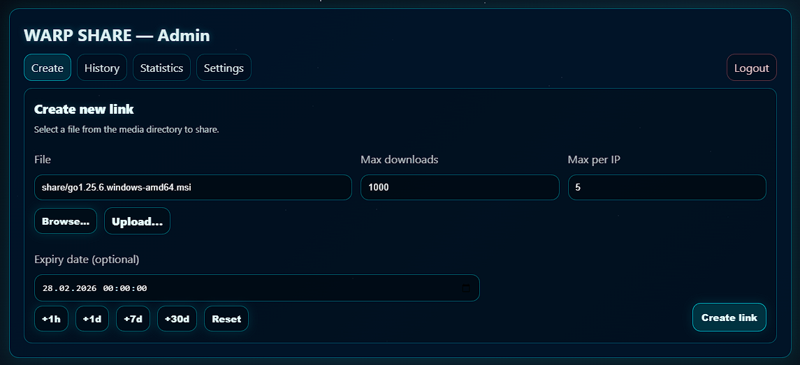
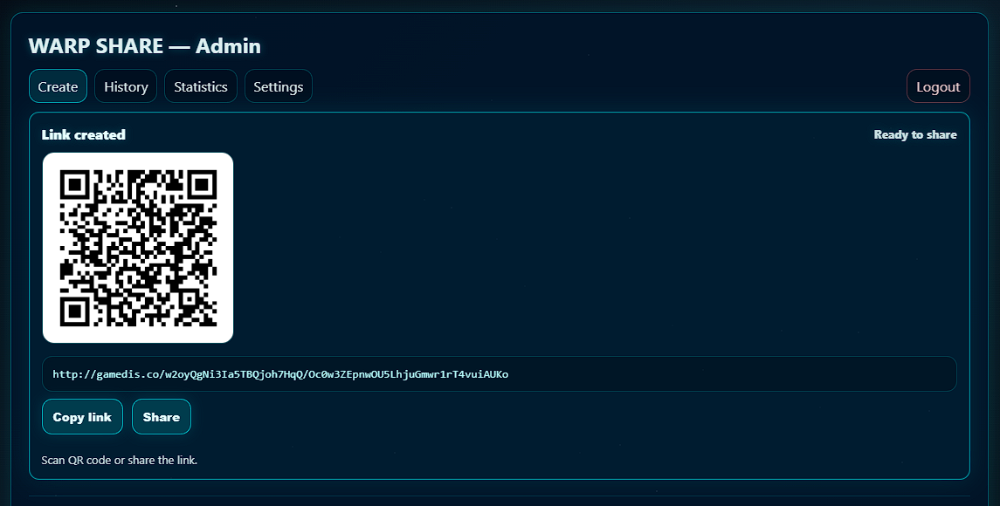
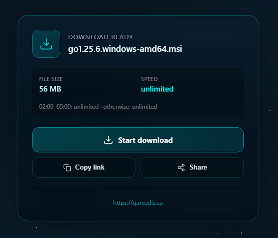

<p align="center">
  
</p>

<p align="center">
  <strong>Secure file sharing with time-limited, token-based download links.</strong>
</p>

<p align="center">
  <a href="#features">Features</a> •
  <a href="#quick-start">Quick Start</a> •
  <a href="#installation-modes">Installation</a> •
  <a href="#configuration">Configuration</a> •
  <a href="#screenshots">Screenshots</a>
</p>

---

## Features

- **Token-based sharing** – Unique, cryptographically secure download links
- **Download limits** – Per link or per IP
- **Link expiration** – Optional time-based expiry
- **File browser** – Browse and share files from the admin panel
- **File uploads** – Upload via admin interface
- **Speed limiting** – Bandwidth control with time-based scheduling
- **QR codes** – Auto-generated for share links
- **Statistics** – Download tracking and activity logs
- **HTTPS** – Let's Encrypt or self-signed certificates
- **SQLite** – No external database required

## Requirements

- Docker + Docker Compose (v2)
- OpenSSL
- Ports 80 and 443
- For public mode: domain pointing to your server

### IPv6 readiness (public mode)

If your server has a public IPv6, add an AAAA record for your domain pointing to that IPv6 and allow inbound TCP 80/443. nginx already listens on IPv6.

Also make sure your TLS certificate covers the hostname users/testers will hit (many checks use `www`). If you publish `www` (A/AAAA), include `www.<domain>` as a SAN in the Let's Encrypt certificate.

## Quick Start

```bash
git clone https://github.com/2g4y1/warp-share.git
cd warp-share
./setup.sh
```

## Installation Modes

### 🌐 Public Mode (Option 1)

For internet-accessible deployments.

- Requires domain pointing to server
- Automatic SSL via Let's Encrypt
- Certificate auto-renewal

### 🏠 Local Mode (Option 2)

For LAN/localhost deployments.

- Works with `localhost`, IPs, or local hostnames
- Self-signed certificate (365 days)
- No internet required

## What setup.sh does

1. Asks for installation mode
2. Collects domain/hostname and file paths
3. Creates `.env` file
4. Configures nginx
5. Creates SSL certificate
6. Builds and starts containers
7. Shows admin path and bootstrap password (if generated)

## Configuration

### `MEDIA_ROOT` – Your files (read-only)

The directory to share. Mounted **read-only**.

### `UPLOAD_TEMP` – Temporary upload storage

Temp directory for uploads before moving to final location. Default: `./temp`

### Example `.env`

```bash
PUBLIC_BASE=https://share.example.com
DOMAIN=share.example.com
MEDIA_ROOT=/srv/files
UPLOAD_TEMP=./temp
TZ=Europe/Vienna
LOCAL_MODE=false
CERTBOT_EMAIL=admin@example.com
```

### Environment Variables

These are set in `.env` and used by `docker-compose.yml`:

| Variable | Description |
|----------|-------------|
| `PUBLIC_BASE` | Public URL (required) |
| `DOMAIN` | Domain/hostname for SSL certificate |
| `MEDIA_ROOT` | Host path to shared files (required) |
| `UPLOAD_TEMP` | Host path for upload temp (default: `./temp`) |
| `TZ` | Timezone (default: `Europe/Vienna`) |
| `LOCAL_MODE` | `true` for self-signed cert |
| `CERTBOT_EMAIL` | Email for Let's Encrypt (optional) |

Internal container paths are configured in `docker-compose.yml` and generally don't need changes.

## Directory Structure

```
warp-share/
├── .env                 # Configuration
├── docker-compose.yml   # Container orchestration
├── setup.sh             # Setup script
├── nginx/               # Reverse proxy config
└── sharesvc/            # Go backend source
```

### Docker Volumes

| Volume | Permission | Purpose |
|--------|------------|---------|
| `warp_data` | RW | Database, sessions, config |
| `MEDIA_ROOT` | **RO** | Your files (read-only) |
| `UPLOAD_TEMP` | RW | Upload temp storage |

## Manual Start

```bash
docker compose up -d
docker exec warp-share sh -c 'cat /data/admin_path'
docker exec warp-share sh -c 'cat /data/bootstrap_admin_password'
```

## Architecture

```
Client → nginx (443) → warp-share → SQLite + Files
              ↓
         certbot (SSL renewal)
```

- **nginx** – Reverse proxy, HTTPS, rate limiting
- **warp-share** – Go backend (runs as UID 1000)
- **certbot** – Certificate renewal (public mode)
- **SQLite** – WAL mode database

## Security

### Authentication

- Passwords hashed with bcrypt
- Sessions stored server-side (SHA-256 hashed tokens)
- Cookies: `HttpOnly`, `Secure`, `SameSite=Strict`
- Login rate limiting with exponential backoff

### Passkeys (WebAuthn)

- Optional passkey login for admin UI (disabled by default)
- Enable with `PASSKEYS_ENABLED=true`
- Required:
  - `PASSKEYS_RP_ID` (domain without scheme/port)
  - `PASSKEYS_RP_ORIGINS` (comma-separated origins)
- Optional tuning:
  - `PASSKEYS_TIMEOUT`, `PASSKEYS_USER_VERIFICATION`, `PASSKEYS_RESIDENT_KEY`
  - `PASSKEYS_AUTHENTICATOR_ATTACHMENT`, `PASSKEYS_ATTESTATION`

### Download Links

- Share slugs: 16 bytes random (128-bit)
- Link tokens: 24 bytes random (192-bit)
- Token hashes stored, not plaintext
- Per-IP tracking and optional limits

### Admin Path

- Auto-generated: 16 bytes → 22 Base64 characters
- Saved to `/data/admin_path`
- Unknown paths return 404

### Bootstrap Password

- Generated on first start if `BOOTSTRAP_ADMIN_PASSWORD` is not set
- Stored in `/data/bootstrap_admin_password` with `0600` permissions
- Not logged to stdout (delete the file after first login)

### File Access

- `MEDIA_ROOT` mounted read-only
- Path traversal protection
- Symlinks validated against root

### Network

- HTTPS enforced
- TLS 1.2+ with modern ciphers
- Security headers (X-Frame-Options, CSP, etc.)
- CSRF protection on admin forms
- Rate limiting on endpoints

## Local Mode Details

| Feature | Behavior |
|---------|----------|
| SSL Certificate | Self-signed, 365 days |
| SSL Stapling | Disabled |
| Let's Encrypt | Skipped |
| Certbot | Not used |

### Browser Certificate Warning

Self-signed certs trigger warnings. Click through:
- **Chrome**: Advanced → Proceed
- **Firefox**: Advanced → Accept the Risk
- **Safari**: Show Details → visit this website

## Admin Tools

### Reset Password

```bash
docker exec warp-share warp-admin reset-password admin
```

The new password is written to `/data/bootstrap_admin_password` and echoed from that file.

### List Users

```bash
docker exec warp-share warp-admin list-users
```

## Troubleshooting

### View admin credentials

```bash
docker exec warp-share sh -c 'cat /data/admin_path'
docker exec warp-share sh -c 'cat /data/bootstrap_admin_password'
```

### Regenerate certificate (local mode)

```bash
rm -rf certbot_data/live/localhost
./setup.sh
```

### Check container status

```bash
docker compose ps
docker compose logs -f
```

### Upload permission errors

```bash
chown -R 1000:1000 /path/to/upload/temp
chown -R 1000:1000 /path/to/media/share
```

## Uninstall

```bash
docker compose down
docker volume rm warp-share_warp_data warp-share_certbot_www
rm -rf .env certbot_data/
```

Your files in `MEDIA_ROOT` are **not affected**.

---

## Screenshots

### Admin Panel

| Upload Interface | Upload Complete |
|------------------|----------------|
|  |  |

### Download Page

| Download Overview |
|-------------------|
|  |

---

<p align="center">
  <sub>Made with ☕ by <a href="https://github.com/2g4y1">2g4y1</a></sub>
</p>
